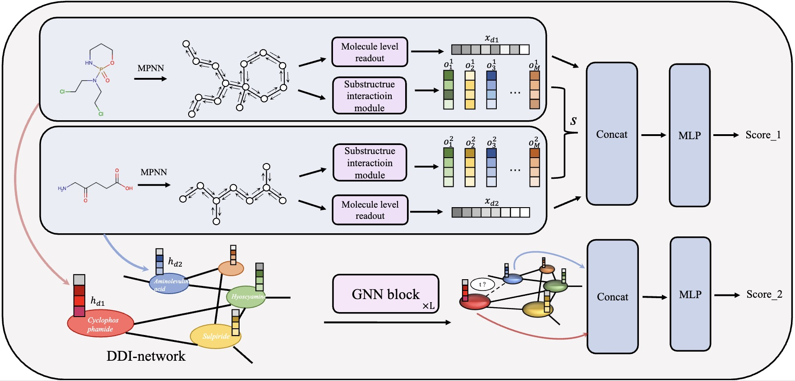

# Drug-drug interaction prediction via hierarchical structure modeling

Official Implementation of "Drug-drug interaction prediction via hierarchical structure modeling" (SCIENTIA SINICA Informationis) "基于层次化结构建模的药物相互作用类型预测" (中国科学信息科学)

http://engine.scichina.com/doi/10.1360/SSI-2024-0106



## Install

1. Clone this repo and setup the environment

```
git clone https://github.com/wuhuaijin/HierDDI.git
cd HierDDI
conda create -n HierDDI python=3.9 -y
conda activate HierDDI
pip install -r requirements.txt
```


2. Unzip the files in ./dataset/data/

```
unzip ./dataset/data/twosides/inductive/twosides_ind_train.json.zip
unzip ./dataset/data/twosides/transductive/twosides_train.json.zip
```

## Training

1. for transductive setting

```
python main.py --dataset drugbank (or twosides) --lr 0.0001
```

2. for inductive setting

```
python main.py --dataset drugbank (or twosides) --lr 0.0001 --tgnn GAT --inductive
```

## Citation

If you use our code or method in your work, please consider citing the following:

```

```

## Acknowledgement

We appreciate the following works for their valuable code and data:

https://github.com/Hienyriux/MSAN

